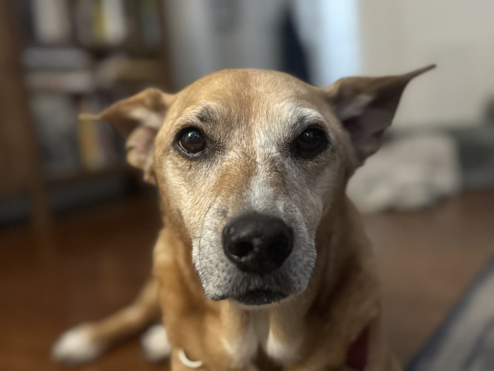
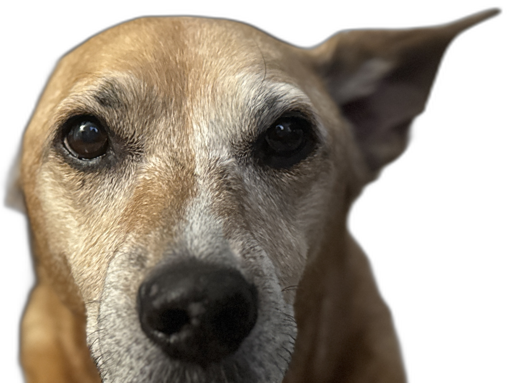
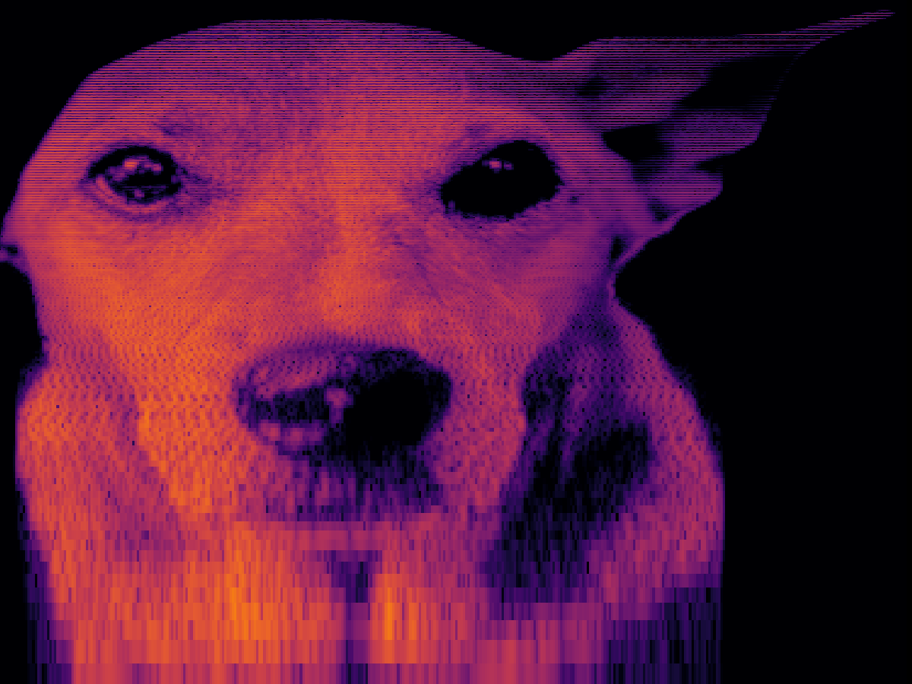

# aphex-maker

Embed an image into audio so it's visible in a spectrogram. Inspired by the Aphex Twin "[Equation](https://en.wikipedia.org/wiki/Windowlicker#Spectrogram)" technique.

## Original photo → background removed → spectrogram

<p>
  
  
  
</p>

https://github.com/user-attachments/assets/83716582-398d-45e1-98c3-aaab234378b6

*Shoutout to our lovely model Melody.*

## Setup

Requires Python 3.10+. If you don't have Python, grab it from [python.org](https://www.python.org/downloads/).

```bash
# clone the repo
git clone https://github.com/noahbaxter/aphex-maker.git
cd aphex-maker

# create a virtual environment (keeps things clean)
python3 -m venv .venv
source .venv/bin/activate   # on Windows: .venv\Scripts\activate

# install
pip install -e .
```

After this, the `aphex-maker` and `aphex-prep` commands will be available in your terminal (as long as the virtual environment is active).

## Usage

### 1. Prep an image (optional)

If your image has a busy background (e.g. a photo), strip it first:

```bash
aphex-prep photo.jpeg
```

This removes the background, crops to the subject, and outputs `out/photo_prep.png` with transparency. First run downloads the U2-Net model (~170MB).

Options:

```
aphex-prep photo.jpeg -o clean.png    # custom output path
aphex-prep photo.jpeg --padding 20    # more space around subject (default: 10)
aphex-prep photo.jpeg --no-crop       # keep original dimensions
aphex-prep photo.jpeg --expand 5      # expand mask to keep more border pixels
```

### 2. Generate audio

```bash
aphex-maker out/photo_prep.png -o output.wav
```

This synthesizes a WAV file where the image is embedded in the frequency spectrum, and saves a spectrogram preview (`output_spectrogram.png`) so you can verify the result.

Options:

```
aphex-maker input.png -o out.wav --duration 5         # 5 second clip (default: 10)
aphex-maker input.png --freq-min 200 --freq-max 8000  # narrower freq range
aphex-maker input.png --linear-freq                    # linear frequency mapping (default: log)
aphex-maker input.png --blur 1.5                       # anti-alias pixel boundaries
aphex-maker input.png --height 256 --width 512         # resize image before synthesis
aphex-maker input.png --noise-floor -60                # kill quiet pixels more aggressively (default: -80)
aphex-maker input.png --gamma 1.5                      # adjust brightness curve
aphex-maker input.png --edges 1.0                      # edge detection mode
aphex-maker input.png --invert                         # negative-space spectrogram
aphex-maker input.png --detune 0.5                     # frequency detune for organic tones
aphex-maker input.png --stereo-spread 0.5              # stereo width (0 = mono, 1 = full)
aphex-maker input.png --no-preview                     # skip spectrogram image
aphex-maker input.png --sample-rate 48000              # custom sample rate (default: 44100)
```

### 3. Config presets

Instead of passing a bunch of flags, use a config file or a bundled preset:

```bash
aphex-maker input.png --config legible        # bundled preset for readable spectrograms
aphex-maker input.png --config ./custom.toml  # your own TOML file
```

You can also drop a `config.toml` in your working directory and it will be picked up automatically.

### Full pipeline example

```bash
aphex-prep photo.jpeg
aphex-maker out/photo_prep.png -o photo.wav --config legible
# check photo_spectrogram.png, then open photo.wav in Audacity/Spek
```

## How it works

- Image is converted to grayscale (alpha channel controls transparency → silence)
- Each row of pixels maps to a sine wave at a specific frequency (bottom = low, top = high)
- Each column maps to a point in time
- Pixel brightness = amplitude of that frequency at that time
- All sinusoids are summed together with random phases to avoid interference artifacts
- Result is normalized and written as 16-bit WAV

## Tips

- **Simpler images work better** — high-contrast silhouettes and line art produce the clearest spectrograms
- **Fewer frequency bins** (`--height 128`) = cleaner separation between tones
- **Log scale** (default) matches how most spectrogram viewers display, giving more detail in lower frequencies
- **Blur** helps smooth out pixel boundaries that can look jagged in the spectrogram
- Use a spectrogram viewer like [Spek](https://www.spek.cc/) or Audacity for the best verification
